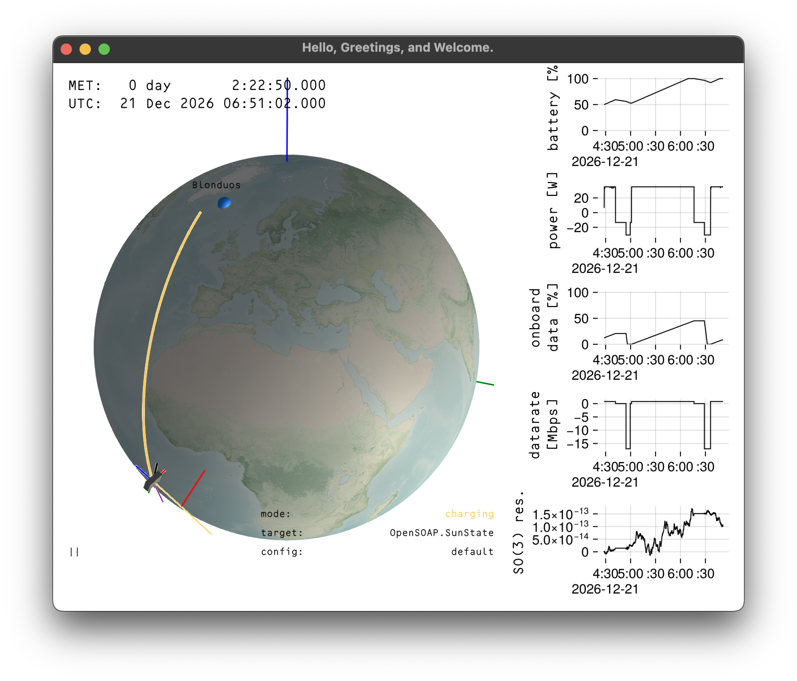

# OpenSOAP

Spacecraft Operations Analysis Package

## What it is

OpenSOAP is a simulator for spacecraft in LEO, with a bent for early mission design, CONOPs exploration, and technical budget analysis. When you run it, it looks like this:



The following dynamical properties are simulated:

- orbit
- attitude
- onboard power
- onboard data
- onboard operating mode (e.g. charging, science, etc.)

None of the modeled dynamics are state-of-the-art fidelity, but they are good for first-order designs.

## To run it

You will need an installation of [Julia](https://julialang.org/).

Clone the repository into a nice place on your computer, go into the director, and launch the Julia REPL:

```console
$ git clone https://github.com/thanasipantazides/OpenSOAP.git
$ cd OpenSOAP
$ julia --project=.
```

From the REPL, hit the `]` key to go into the package manager. Your prompt should change, and you should run `instantiate` to install required packages.
```julia-repl
julia> ] 
(OpenSOAP) pkg> instantiate
```

You can hit backspace to get back to the `julia>` prompt from the package prompt. 

To launch the interactive orbit viewer, use the example called `both.jl`:

```julia-repl
julia> include("examples/both.jl")
```

This will probably precompile for a while. This happens the first time you run something from a new REPL session, but subsequent runs are much faster. Once that's done, run the main function:

```julia-repl
julia> main()
```

You should see a display like the one further up this page. Press the `h` key for a help menu. 

To exit, close the window, then press `ctrl-C` in the Julia REPL a few times. 

## To do
- [ ] swap underlying socket to UDP so there is no locking of sim based on TCP. Note: because of the current Julia implementation of sockets, there is no  
- [x] add PD control on $\mathrm{SO}(3)$ directly.
- [ ] ingest complex config. Or maybe a callback-ability for state transition events. or something.
- [ ] Make it easier to launch and exit.
- [ ] later: hot reload of config. I.e. a watcher for config file that reloads the spacecraft and target config (but not initial conditions). 